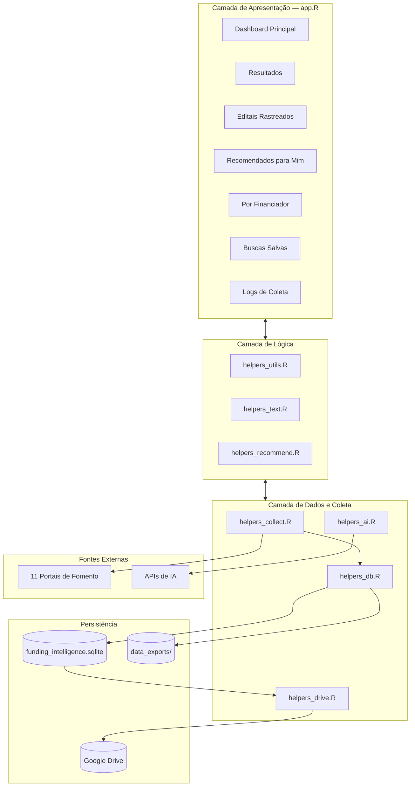

# QuIIN - QFunding Intelligence Hub

[](https://www.r-project.org/)
[](https://shiny.posit.co/)
[](#licença)
[](https://www.docker.com/)
[](https://www.senaicimatec.com.br/)

Plataforma de inteligência estratégica para monitoramento, busca booleana avançada e recomendação personalizada de editais de financiamento científico e tecnológico — nacionais e internacionais.

Centraliza **11 fontes de fomento** (CNPq, CAPES, FINEP, FAPESB, Horizon Europe, ERC, SIGITEC, UNDP, EMBRAPII, DAAD, Quantum) em uma única interface, enriquece cada oportunidade com IA generativa multi-provedor, traduz automaticamente registros europeus para pt-br e recomenda parceiros internos com base em afinidade temática.

---

## Visão Geral

| Componente | Status |
|---|---|
| Coleta multi-agência (6 fontes ativas + FTOP proxy) | ✅ Produção |
| Processamento assíncrono (background) | ✅ Produção |
| Enriquecimento com IA (8 provedores) | ✅ Produção |
| Tradução automática pt-br (fontes EU) | ✅ Produção |
| Busca booleana avançada (AST parser) | ✅ Produção |
| Aderência dinâmica por query | ✅ Produção |
| Recomendação de parceiros CIMATEC | ✅ Produção |
| Sincronização Google Drive | ✅ Produção |
| Containerização Docker | ✅ Produção |

---

## Quick Start

### 1. Instalar dependências

```r
install.packages(c(
  "shiny", "bslib", "DT", "dplyr", "tidyr", "purrr", "stringr", "stringi",
  "lubridate", "ggplot2", "plotly", "DBI", "RSQLite", "jsonlite", "digest",
  "htmltools", "rvest", "xml2", "httr2", "tibble", "readr", "writexl",
  "janitor", "glue", "progress", "pdftools", "polite", "callr",
  "shinycssloaders", "reticulate", "chromote", "googledrive", "httr",
  "memoise", "uuid"
))
```

### 2. Configurar variáveis de ambiente

Crie o arquivo `.Renviron` na raiz do projeto:

```env
# Pelo menos uma chave de IA é obrigatória
GROQ_API_KEY=sua_chave_aqui

# Google Drive (opcional)
GDRIVE_SERVICE_ACCOUNT_JSON=gdrive_credentials.json
GDRIVE_FILE_ID=id_do_arquivo_no_drive
```

### 3. Executar

```r
shiny::runApp()
```

A aplicação estará disponível em `http://localhost:3838`.

---

## Arquitetura do Sistema



---

## Fontes de Dados

### Fontes Ativas

| ID | Fonte | País | Método de Coleta | Idioma |
|---|---|---|---|---|
| `cnpq` | Conselho Nacional de Desenvolvimento Científico e Tecnológico | Brasil | HTML scraper | pt |
| `capes` | Coordenação de Aperfeiçoamento de Pessoal de Nível Superior | Brasil | Plone API + HTML fallback | pt |
| `finep` | Financiadora de Estudos e Projetos | Brasil | Liferay REST API | pt |
| `fapesb` | Fundação de Amparo à Pesquisa do Estado da Bahia | Brasil | WordPress REST API | pt |
| `horizon_europe` | Horizon Europe | UE | EU F&T Portal REST API | en → pt (tradução automática) |
| `erc` | European Research Council | UE | EU F&T Portal REST API | en → pt (tradução automática) |
| `sigitec` | Petrobras SIGITEC | Brasil | REST API | pt |
| `undp` | UNDP Brasil | Brasil | JS component + HTML | pt |
| `embrapii` | EMBRAPII | Brasil | HTML scraping | pt |
| `daad` | DAAD Brasil | Alemanha | Hybrid JSON+HTML | en |
| `quantum` | EU Quantum Technologies | UE | EU FTOP REST API | en |

**Coletores especializados:**

- `collect_capes` — Plone REST API (`/++api++/pt-br/@search`) com fallback Playwright
- `collect_finep` — Liferay Headless Delivery API com filtro `situacao=aberta`
- `collect_fapesb` — WordPress REST API (`/wp-json/wp/v2/posts?categories=11`)
- `collect_horizon_europe` — EU F&T Portal Search API com 21 termos de busca (EIC, MSCA, WIDERA, CL2-CL5, EURATOM)
- `collect_erc` — EU F&T Portal Search API com termos ERC específicos
- `collect_sigitec` — REST API SIGITEC com listing + detalhe por ID
- `collect_undp` — Componente externo UNDP (JSON) + HTML de detalhe
- `collect_embrapii` — Parsing HTML estático da página de transparência
- `collect_daad` — Híbrido: JSON catálogo global (scholarships.js) + HTML scraping detalhe
- `collect_quantum` — EU F&T Portal Search API com busca por keyword "quantum"
- `collect_generic_official` — Fallback HTML para CNPq e fontes não especializadas

> **Nota sobre fontes EU:** Horizon Europe e ERC utilizam a EU F&T Portal API via
> Cloudflare Worker proxy para contornar bloqueio de IPs da AWS no Posit Connect Cloud.
> Veja a seção [Configuração do Proxy FTOP](#configuração-do-proxy-ftop-cloudflare-worker).

### Fontes Descontinuadas

As seguintes fontes foram removidas na versão atual do sistema (commit `fbaa74c`):

| Fonte | Motivo da Remoção |
|---|---|
| FAPESP, FAPERJ, FAPEMIG, FAPES/ES, FAPESC/SC | FAPES regionais com estruturas de URL instáveis |
| CONFAP, BNDES, MCTI | Fontes com atualização irregular ou baixa aderência |
| Petrobras SIGITEC | API descontinuada ou inacessível |
| NIH, NSF, Wellcome Trust, Gates Foundation | Fontes internacionais com scraping complexo |
| IDRC, UNESCO, World Bank, IDB | Baixo volume de editais relevantes |
| EUREKA Network | Fontes europeias consolidadas no Horizon Europe |
| UNDP Brasil, Ministério da Saúde, iCS | Fontes temáticas com escopo limitado |

---

## Estrutura de Módulos

### `app.R` — Ponto de Entrada (~1.600 linhas)

Interface Shiny com `bslib` e Bootstrap 5. Responsável por:

- Inicializar o banco SQLite (baixando do Google Drive se configurado)
- Definir UI reativa com sidebar de filtros rápidos
- Gerenciar coleta em background via `callr` com prevenção de processos zumbis
- Streaming de logs em tempo real via `collection_status.json`
- Sincronização automática com Google Drive

### `R/helpers_collect.R` — Motor de Coleta (~4.100 linhas)

Módulo mais extenso do sistema. Pipeline de coleta:

1. `source_dispatch()` — despacha estratégia correta para cada `id_fonte`
2. `collect_listing_with_pagination()` — navega páginas de listagem
3. `extract_detail_bundle()` — baixa detalhes de cada oportunidade
4. `finalize_records()` — normaliza, infere campos e deduplica
5. `translate_to_pt_br()` — traduz registros EU para pt-br via IA

**Estratégias de requisição (em cascata):**
- `httr2` → Playwright (Python via `reticulate`) → `chromote` (R nativo)
- Detecção de CDN/CAPTCHA (Cloudflare, Ray ID, Access Denied)

### `R/helpers_ai.R` — IA Multi-Provedor (~867 linhas)

Pipeline de extração em 2 estágios:

1. `skill_extract_metadata()` — extração de metadados estruturados
2. `skill_verify_metadata()` — auditoria automática de qualidade

**Provedores suportados:** Bluesminds, Gemini, OpenAI, NVIDIA, Anthropic, Groq, OpenRouter, DeepSeek

**Função de tradução:** `translate_to_pt_br()` — traduz título e resumo de registros europeus para pt-br using IA.

### `R/helpers_db.R` — Persistência (~722 linhas)

- SQLite em modo WAL com busy timeout
- Schema idempotente com `IF NOT EXISTS`
- Catálogo de 11 fontes com UPSERT
- Migrações automáticas de schema

### `R/helpers_text.R` — Busca Booleana (247 linhas)

- Lexer tokenizador (AND, OR, NOT, parênteses, frases exatas)
- Parser recursivo → AST
- Avaliador de AST sobre índice textual

### `R/helpers_recommend.R` — Recomendação (146 linhas)

- Score de aderência: keywords (40%) + áreas (20%) + financiador (15%) + elegibilidade (15%) + país (10%)
- Recomendação de parceiros CIMATEC por afinidade temática

### `R/helpers_drive.R` — Google Drive Sync (90 linhas)

- Autenticação via Service Account
- Download na inicialização, upload após coleta e no `onStop`

### `R/helpers_utils.R` — Utilitários (633 linhas)

- Parsing de datas, valores monetários, normalização de texto
- `%||%` (null-coalescing), botões de ação HTML

---

## Modelo de Dados

```
funding_intelligence.sqlite
├── fontes_financiamento      — Catálogo de 11 agências ativas
├── oportunidades             — Editais coletados e enriquecidos pela IA
├── editais_rastreados        — Funil de candidaturas do usuário
├── perfil_usuario            — Preferências institucionais e áreas de interesse
├── buscas_salvas             — Consultas salvas com opção de alerta
├── historico_buscas          — Registro cronológico de buscas executadas
├── colaboradores             — Banco de parceiros externos classificados por expertise
├── pesquisadores_vencedores  — Banco de talentos CIMATEC com expertise declarada
├── projetos_aprovados        — Histórico de captação (FK → pesquisadores_vencedores)
├── logs_coleta               — Rastreabilidade de execuções do scraper
└── metrics_coleta            — Métricas de desempenho por fonte
```

### Tabela `oportunidades` — campos principais

| Campo | Tipo | Descrição |
|---|---|---|
| `id_registro` | TEXT PK | `{fonte}_{hash16}` — identificador único determinístico |
| `hash_deduplicacao` | TEXT UNIQUE | Hash xxHash64 de título + URL de origem |
| `titulo` | TEXT | Título limpo (traduzido para pt-br se fonte EU) |
| `descricao_resumida` | TEXT | Resumo informativo gerado pela IA |
| `palavras_chave` | TEXT | 5–8 termos do domínio científico/tecnológico |
| `elegibilidade` | TEXT | Critérios específicos de elegibilidade |
| `area_tematica` | TEXT | Áreas de conhecimento cobertas |
| `valor_financiado` | REAL | Valor numérico máximo do financiamento |
| `data_limite` | TEXT | Data de submissão (`YYYY-MM-DD`) |
| `status_oportunidade` | TEXT | `aberto` / `encerrado` / `futuro` |
| `idioma` | TEXT | Código do idioma (`pt`, `en`) |
| `campos_inferidos_ia` | TEXT | Lista dos campos preenchidos pela IA (cache) |
| `texto_bruto` | TEXT | Texto completo capturado para indexação |

---

## Pipeline de IA — Fluxo Detalhado

```
Texto Bruto do Edital (até 20.000 chars)
        │
        ▼
┌─────────────────────────────────┐
│  STAGE 1: skill_extract_metadata │
│  • System prompt: persona sênior │
│  • Campos: título, resumo,        │
│    keywords, elegibilidade,       │
│    tipo, status, datas, valor     │
└──────────────┬──────────────────┘
               │ JSON
               ▼
┌─────────────────────────────────┐
│  STAGE 2: skill_verify_metadata  │
│  • Auditoria de resumo           │
│  • Filtragem de keywords ruins   │
│  • Validação de data_limite      │
└──────────────┬──────────────────┘
               │ JSON auditado
               ▼
┌─────────────────────────────────┐
│  STAGE 3: translate_to_pt_br     │
│  • Apenas para fontes EU         │
│  • Traduz titulo + resumo        │
│  • Atualiza idioma para "pt"     │
└──────────────┬──────────────────┘
               │
               ▼
     Salvo no banco SQLite
     (campo campos_inferidos_ia)
```

> **Cache inteligente**: Registros com `campos_inferidos_ia` preenchido são pulados no próximo ciclo.

---

## Como Executar

### Pré-requisitos

| Componente | Versão Mínima | Obrigatório |
|---|---|---|
| R | 4.6+ | Sim |
| RStudio | 2024.04+ | Não (mas recomendado) |
| Docker | 24.0+ | Apenas para Opção 2 |
| Python | 3.10+ | Apenas para scraping JS |

### Opção 1 — Local (R)

```r
# 1. Instalar dependências
source("https://raw.githubusercontent.com/...")  # ou manual conforme Quick Start

# 2. Configurar .Renviron (veja seção Variáveis de Ambiente)

# 3. Executar
shiny::runApp()
```

### Opção 2 — Docker (Recomendado para Produção)

```bash
# 1. Configurar variáveis de ambiente
cp .env.example .env   # edite com suas chaves

# 2. Build e execução
docker compose up -d

# 3. Acessar
open http://localhost:3838
```

### Verificando a Instalação

```r
# Verificar pacotes
pkgs <- c("shiny", "bslib", "DT", "httr2", "DBI", "RSQLite", "reticulate")
missing <- pkgs[!sapply(pkgs, requireNamespace, quietly = TRUE)]
if (length(missing) > 0) warning("Pacotes faltando: ", paste(missing, collapse = ", "))

# Verificar IA
source("R/helpers_ai.R")
ai_available()  # deve retornar TRUE se chave configurada

# Verificar banco
source("R/helpers_db.R")
conn <- DBI::dbConnect(RSQLite::SQLite(), "funding_intelligence.sqlite")
DBI::dbListTables(conn)  # deve listar 11 tabelas
DBI::dbDisconnect(conn)
```

---

## Configuração do Proxy FTOP (Cloudflare Worker)

### Por que é necessário?

A EU F&T Portal API (`api.tech.ec.europa.eu`) **bloqueia requisições vindas de IPs da AWS**. O Posit Connect Cloud roda na AWS, logo as coletas de Horizon Europe e ERC falham sem proxy.

A solução é um **Cloudflare Worker** que atua como intermediário: Connect → Worker (IP não-AWS) → FTOP API.

### Fluxo

```
Posit Connect Cloud (AWS)
        │
        ▼ HTTP POST
Cloudflare Worker (IP neutro)
        │
        ▼ HTTP POST (forward)
api.tech.ec.europa.eu/search?apiKey=SEDIA
        │
        ▼ JSON
Cloudflare Worker → Connect → Grava no SQLite
```

### Passo 1 — Criar conta Cloudflare

1. Acesse [dash.cloudflare.com](https://dash.cloudflare.com)
2. Crie uma conta gratuita (plano gratuito: 100.000 requisições/dia)

### Passo 2 — Criar o Worker

1. No painel, vá em **Workers & Pages** → **Create** → **Create Worker**
2. Escolha um nome (ex: `ftop-proxy`)
3. Clique em **Deploy** (código inicial irrelevante)

### Passo 3 — Configurar o código do Worker

1. Clique em **Edit code** (aba "Code")
2. Substitua todo o conteúdo pelo código abaixo:

```javascript
export default {
  async fetch(request) {
    const url = new URL(request.url);

    // Allow CORS from anywhere
    const corsHeaders = {
      "Access-Control-Allow-Origin": "*",
      "Access-Control-Allow-Methods": "GET, POST, OPTIONS",
      "Access-Control-Allow-Headers": "Content-Type",
    };

    if (request.method === "OPTIONS") {
      return new Response(null, { headers: corsHeaders });
    }

    // Forward to FTOP API
    const targetUrl =
      "https://api.tech.ec.europa.eu" + url.pathname + url.search;

    const newRequest = new Request(targetUrl, {
      method: request.method,
      headers: {
        "User-Agent":
          "Mozilla/5.0 (Windows NT 10.0; Win64; x64) AppleWebKit/537.36 (KHTML, like Gecko) Chrome/131.0.0.0 Safari/537.36",
        Referer: "https://ec.europa.eu/info/funding-tenders/opportunities/portal/",
        Origin: "https://ec.europa.eu",
        Accept: "application/json, text/plain, */*",
        "Accept-Language": "en-US,en;q=0.9",
        "Content-Type": request.headers.get("Content-Type") || "application/x-www-form-urlencoded",
      },
      body: request.method !== "GET" && request.method !== "HEAD" ? await request.arrayBuffer() : undefined,
    });

    const response = await fetch(newRequest);
    const responseBody = await response.arrayBuffer();

    return new Response(responseBody, {
      status: response.status,
      headers: {
        ...corsHeaders,
        "Content-Type": response.headers.get("Content-Type") || "application/json",
      },
    });
  },
};
```

4. Clique em **Deploy**

### Passo 4 — Verificar o Worker

Teste no terminal:

```bash
curl -X POST "https://SEU-WORKER.seu-usuario.workers.dev/search?apiKey=SEDIA&text=HORIZON&pageSize=1"
```

Deve retornar JSON com `"totalResults"` > 0.

### Passo 5 — Configurar no Posit Connect

1. No painel do Connect, vá em **Environment** (ou **Variables**)
2. Adicione a variável:

| Variable | Value |
|---|---|
| `EU_API_PROXY_URL` | `https://SEU-WORKER.seu-usuario.workers.dev` |

3. Faça **restart** do aplicativo

### Troubleshooting

| Sintoma | Causa | Solução |
|---|---|---|
| `curl: (7) Failed to connect` | Worker URL incorreta ou não deployado | Verificar URL no Dashboard do Cloudflare |
| HTTP 404 do Worker | Rota incorreta | Verificar se Worker forwarda corretamente |
| `totalResults: 0` | Filtros de query muito específicos | Testar com `text=HORIZON` primeiro |
| Connect依旧 falha | Variável não propagada | Reiniciar app no Connect após adicionar env var |

---

## Variáveis de Ambiente

### IA (pelo menos uma obrigatória)

| Variável | Descrição | Padrão |
|---|---|---|
| `GROQ_API_KEY` | Chave Groq (recomendado para testes) | — |
| `OPENAI_API_KEY` | Chave OpenAI | — |
| `GEMINI_API_KEY` | Chave Google Gemini | — |
| `BLUESMINDS_API_KEY` | Chave Bluesminds | — |
| `NVIDIA_API_KEY` | Chave NVIDIA Build | — |
| `ANTHROPIC_API_KEY` | Chave Anthropic Claude | — |
| `OPENROUTER_API_KEY` | Chave OpenRouter | — |
| `DEEPSEEK_API_KEY` | Chave DeepSeek | — |

### Configuração de IA (opcional)

| Variável | Descrição | Padrão |
|---|---|---|
| `AI_PROVIDER` | Força provedor específico | auto-detect |
| `AI_MODEL` | Força modelo específico | provedor-dependent |
| `AI_API_URL` | Endpoint customizado | provedor-dependent |
| `AI_MAX_CHARS` | Contexto máximo por edital | `20000` |
| `AI_VERIFY_METADATA` | Habilita auditoria de qualidade | `true` |
| `AI_BATCH_SIZE` | Lote de requisições paralelas | `3` |
| `AI_DELAY_BETWEEN_BATCHES` | Atraso entre lotes de IA (seg) | `2` |

### Google Drive (opcional)

| Variável | Descrição |
|---|---|
| `GDRIVE_SERVICE_ACCOUNT_JSON` | Caminho para arquivo JSON de Service Account |
| `GDRIVE_SERVICE_ACCOUNT_CONTENT` | Conteúdo JSON inline da Service Account |
| `GDRIVE_FILE_ID` | ID do arquivo SQLite no Google Drive |

### API Europeia (necessário para Posit Connect)

| Variável | Descrição | Padrão |
|---|---|---|
| `EU_API_PROXY_URL` | URL do Cloudflare Worker proxy para FTOP API | (vazio = FTOP direto) |

---

## Fluxo do Usuário

1. **Exploração Inicial** — Ao abrir pela primeira vez, a base é semeada com dados demonstrativos
2. **Atualizar Base** — Clique em "Atualizar base" para coletar dados frescos (roda em background)
3. **Busca Avançada** — Use lógica booleana: `(quântica OR "tecnologia quântica") AND bolsa NOT licitação`
4. **Aderência Dinâmica** — Score recalculado em tempo real com base na query ativa
5. **Rastrear Editais** — Adicione editais à aba "Editais Rastreados" para acompanhar candidaturas
6. **Parceiros CIMATEC** — Veja pesquisadores internos recomendados para cada edital rastreado
7. **Recomendações** — A aba "Recomendados para mim" lista editais com maior aderência ao perfil
8. **Exportação** — Bases consolidadas salvas automaticamente em `data_exports/` (CSV, RDS, XLSX)

---

## Segurança e DevSecOps

- **Docker Non-Root** — Container não executa como `root`
- **SQLite WAL** — Leituras simultâneas durante escritas
- **Transações ACID** — UPSERT atômico com `dbBegin`/`dbCommit`
- **Prevenção de Zumbis** — `session$onSessionEnded` elimina processos filhos
- **Playwright Stealth** — Camuflagem de fingerprints contra WAFs
- **HEAD Check** — Verificação de saúde do host antes de scraping pesado
- **.dockerignore** — Impede cópia de chaves para imagem Docker

---

## Testes

```bash
# Testar utilitários
Rscript -e "testthat::test_file('tests/testthat/test-utils.R')"

# Testar concorrência SQLite
Rscript scratch/test_db_concurrency.R

# Testar stealth e conexões
Rscript scratch/test_stealth_request.R

# Testar retries da IA
Rscript scratch/test_ai_backoff.R
```

---

## Licença

Proprietária — SENAI CIMATEC / QuIIN. Uso interno autorizado.

---

## Contato

**QuIIN — Núcleo de Economia e Industrial**
SENAI CIMATEC — Salvador, BA, Brasil
