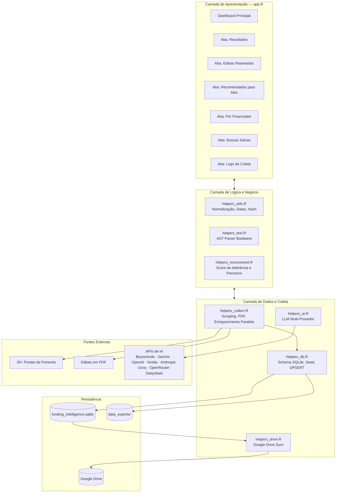

# Funding Intelligence Hub

O **Funding Intelligence Hub** é uma plataforma analítica desenvolvida em **R/Shiny** para automatizar o monitoramento, a busca booleana avançada e a recomendação personalizada de editais, chamadas públicas e oportunidades de financiamento científico e tecnológico — nacionais e internacionais.

O sistema foi concebido como uma ferramenta de inteligência estratégica para pesquisadores e equipes de captação de recursos, centralizando o monitoramento de **30+ agências de fomento** em uma única interface, enriquecendo cada oportunidade com análise de IA generativa e oferecendo recomendação automática de parceiros internos com base em afinidade temática.

---

## ✅ Status Atual do Projeto

| Componente | Status |
|---|---|
| Coleta multi-agência (30+ fontes) | ✅ Produção |
| Processamento assíncrono (background) | ✅ Produção |
| Enriquecimento com IA (multi-provedor) | ✅ Produção |
| Prompts de qualidade (resumo + keywords) | ✅ Produção |
| Busca booleana avançada (AST parser) | ✅ Produção |
| Aderência dinâmica por query | ✅ Produção |
| Recomendação de parceiros (CIMATEC) | ✅ Produção |
| Sincronização Google Drive | ✅ Produção |
| Containerização Docker | ✅ Produção |
| Pipeline de auditoria da IA (anti-alucinação) | ✅ Produção |

---

## 📌 Funcionalidades Principais

- **Coleta Automatizada com Paginação**: Scraping direto das fontes oficiais com paginação automática (detecção de `rel=next`, paginação numérica e rotas customizadas por agência).
- **Extração de Texto de PDFs**: Download e extração de texto bruto de editais em PDF (`pdftools`) para indexação e análise.
- **Fallback com Navegador Headless**: Suporte a páginas com JavaScript via `chromote` (protocolo DevTools) e `playwright` (via `reticulate`), com evasão stealth de CAPTCHAs.
- **Enriquecimento com IA Generativa**: Pipeline de dois estágios — extração de metadados estruturados e auditoria automática de qualidade — usando qualquer provedor de LLM compatível.
- **Busca Booleana Completa (AST Parser)**: Parser recursivo que converte consultas complexas com `AND`, `OR`, `NOT`, parênteses e frases exatas (`"..."`) em árvores de sintaxe abstrata avaliadas diretamente sobre o índice textual dos editais.
- **Aderência Dinâmica por Query**: Cálculo de score de aderência em tempo real combinando a query de busca ativa com o perfil do usuário, histórico de pesquisas e editais rastreados.
- **Recomendação de Parceiros CIMATEC**: Algoritmo de afinidade temática que recomenda pesquisadores internos para composição de consórcios, com base na sobreposição entre expertise declarada + projetos passados e o tema do edital selecionado.
- **Sincronização Google Drive**: Backup automático do banco de dados SQLite local no Google Drive via Service Account, mantendo a base persistida na nuvem entre sessões.
- **Exportação Automática**: Exportação dos dados em **CSV**, **RDS** e **XLSX** a cada ciclo de coleta concluído.
- **Containerização Docker**: Imagem Docker multi-estágio pronta para deploy em produção, com Python/Playwright e Chrome pré-instalados.

---

## 🏗️ Arquitetura do Sistema

A aplicação é organizada em camadas de responsabilidade bem definidas, separando a interface, a lógica de negócio, o banco de dados, o motor de coleta, o subsistema de IA e a camada de sincronização em nuvem.



---

## 📂 Estrutura de Módulos

### [`app.R`](./app.R)
Ponto de entrada do Shiny. Responsável por:
- Inicializar o banco SQLite (baixando do Google Drive na inicialização, se configurado).
- Definir toda a interface reativa com `bslib` e CSS customizado (`www/styles.css`).
- Gerenciar o ciclo de reatividade do servidor: busca, filtros, exportação, rastreamento e sincronização.
- Lançar a coleta de dados em **processo background isolado** via `callr`, evitando bloqueio da UI.
- Fazer upload do banco atualizado ao Google Drive após cada coleta bem-sucedida ou ao encerrar a sessão (`onStop`).

---

### [`R/helpers_collect.R`](./R/helpers_collect.R)
Motor de coleta, raspagem e enriquecimento. É o módulo mais extenso do sistema (~1.500 linhas). Responsável por:

**Pipeline de coleta por agência:**
1. `source_dispatch()` — despacha a estratégia correta de coleta para cada `id_fonte`.
2. `collect_listing_with_pagination()` — navega páginas de listagem, extrai candidatos com `extract_listing_candidates()` e busca detalhes de cada oportunidade com `extract_detail_bundle()`.
3. `extract_detail_bundle()` — baixa a página de detalhe da oportunidade e extrai o texto completo (HTML e PDF).
4. `extract_core_record()` — monta o registro estruturado com todos os campos do schema.
5. `finalize_records()` / `dedupe_records()` — normaliza, infere campos faltantes e deduplica por `hash_deduplicacao`.

**Estratégias de requisição (em cascata):**
- `safe_request_page()`: tenta sequencialmente `httr2` → Playwright (Python via `reticulate`) → `chromote` (R nativo com injeção stealth via DevTools).
- Detecção e bloqueio de CDN/CAPTCHA (Cloudflare, Ray ID, Access Denied) antes de aceitar o conteúdo.

**Enriquecimento paralelo com IA:**
- `enrich_records_parallel()`: para cada registro novo, verifica cache no banco (`campos_inferidos_ia` preenchido = já processado). Registros novos são agrupados em lotes (`AI_BATCH_SIZE`) e enviados em paralelo via `httr2::req_perform_parallel()`.
- `enrich_record_with_ai()`: enriquece registros individualmente (fluxo sequencial).

**Coletores especializados:**
- `collect_fapes_es()` — coleta PDFs diretamente da listagem de editais abertos.
- `collect_fapesc()` — filtra links de chamadas abertas por padrão de URL/texto.
- `collect_eureka()` — filtra chamadas por padrão `/open-calls/`.
- `collect_sigitec()` — consome a API REST pública do SIGITEC/Petrobras.
- `collect_confap()` — paginação por rota `/page/{n}`.
- `collect_generic_official()` — scraping genérico com paginação automática (padrão para ~20 fontes).

---

### [`R/helpers_ai.R`](./R/helpers_ai.R)
Módulo de integração com IA generativa multi-provedor. Arquitetura em camadas:

**Configuração e autodetecção:**
- `get_ai_config()` — detecta automaticamente o provedor disponível pela presença de chaves de API no ambiente (prioridade: `bluesminds` → `gemini` → `openai` → `nvidia` → `anthropic` → `groq` → `openrouter` → `deepseek`).
- Permite configuração manual via `AI_PROVIDER`, `AI_MODEL`, `AI_API_KEY`, `AI_API_URL`.

**Prompt de Sistema (Persona Fixa):**
```
Você é um especialista sênior em curadoria de editais de fomento científico e tecnológico.
Seu público é PESQUISADORES acadêmicos que buscam financiamento...
```

**Pipeline de extração em 2 estágios:**
1. `skill_extract_metadata()` — Prompt estruturado com campos obrigatórios (`titulo_limpo`, `resumo`, `palavras_chave`, `elegibilidade`, `area_tematica`, `tipo_oportunidade`, `status_oportunidade`, `data_limite`, `data_publicacao`, `valor_financiado`, `moeda`, `observacoes`) e **regras de qualidade explícitas**:
   - Resumo: deve responder "O que financia? Para quem? Em qual área?", com exemplos de saída boa e ruim.
   - Palavras-chave: lista PROIBIDA de termos genéricos, institucionais e funcionais.
2. `skill_verify_metadata()` — Auditoria automática: relê os metadados e o texto bruto, corrige resumo copiado literalmente e palavras-chave inadequadas.

**Execução paralela:**
- `ai_request_parallel()` — Envia múltiplos prompts simultaneamente via `httr2::req_perform_parallel()`.
- Rate limiting inteligente: atraso configurável para Groq (TPM), respiro de 1s entre lotes para outros provedores.
- Context window: até **20.000 caracteres** de texto bruto por edital (`AI_MAX_CHARS`).

**Suporte nativo a APIs:**
| Provedor | Formato de Request | System Role |
|---|---|---|
| Google Gemini | `systemInstruction` separado | ✅ |
| OpenAI, Groq, Bluesminds, OpenRouter, DeepSeek, Nvidia | `messages[role=system]` | ✅ |
| Anthropic | Campo `system` no body | ✅ |

---

### [`R/helpers_db.R`](./R/helpers_db.R)
Camada de persistência e modelo relacional. Responsável por:
- `create_tables()` — cria todas as tabelas com `IF NOT EXISTS` (idempotente).
- `seed_sources()` — popula o catálogo de 30 fontes de fomento com UPSERT.
- `upsert_opportunities()` — insere/atualiza editais com `INSERT OR REPLACE` baseado em `id_registro`.
- `init_database()` — ponto único de inicialização: cria tabelas, semeia catálogo, perfil, buscas demo e aplica migrações de schema.
- Migrações automáticas de schema (ex.: sanitização de `palavras_chave` legadas no formato JSON `["tag1","tag2"]` → `"tag1, tag2"`).

---

### [`R/helpers_text.R`](./R/helpers_text.R)
Subsistema de linguística e busca booleana. Implementa:
- **Lexer tokenizador**: Identifica operadores (`AND`, `OR`, `NOT`), agrupadores (`( )`), frases exatas (`"..."`) e termos simples.
- **Parser recursivo (AST)**: Constrói uma árvore de sintaxe abstrata que representa a estrutura lógica da query.
- **Avaliador**: Percorre a AST para testar cada edital com correspondência textual via regex.
- `build_search_text()` — constrói o índice textual por edital concatenando colunas relevantes.
- Normalização de texto (remoção de acentos, lowercase, whitespace) para comparação robusta.

---

### [`R/helpers_recommend.R`](./R/helpers_recommend.R)
Motor de recomendação e afinidade. Implementa:

**Score de aderência de editais (`compute_adherence_score`):**
| Componente | Peso |
|---|---|
| Sobreposição com keywords do perfil + query ativa | 40% |
| Sobreposição com áreas temáticas preferidas | 20% |
| Financiador na lista de preferências | 15% |
| Elegibilidade compatível | 15% |
| País de origem preferido | 10% |

**Assinatura de interesses dinâmica (`collect_interest_signature`):**
Agrega: perfil do usuário + histórico de buscas (últimas 10) + editais rastreados (palavras-chave e áreas) + query ativa atual.

**Recomendação de parceiros CIMATEC (`recommend_partners_for_opportunity`):**
- Para um edital selecionado, cruza texto do edital com a união de `expertise` declarada + `palavras_chave` de projetos passados de cada pesquisador.
- Retorna ranking com score de afinidade, projetos passados relevantes e termos correspondentes.

---

### [`R/helpers_drive.R`](./R/helpers_drive.R)
Sincronização automática com Google Drive via `googledrive`. Implementa:
- `drive_auth_service()` — autenticação via Service Account JSON (variável de ambiente `GDRIVE_SERVICE_ACCOUNT_JSON` ou conteúdo inline `GDRIVE_SERVICE_ACCOUNT_CONTENT`).
- `drive_download_db()` — baixa o arquivo de banco do Drive na inicialização da aplicação (sobrescreve o local).
- `drive_upload_db()` — envia o banco local atualizado ao Drive após cada coleta bem-sucedida e ao encerrar a sessão (`onStop`).
- Todas as operações são silenciosas: falhas de autenticação ou conectividade não interrompem a aplicação.

---

### [`R/helpers_utils.R`](./R/helpers_utils.R)
Utilitários compartilhados:
- Parsing robusto de datas em múltiplos formatos (`DD/MM/YYYY`, `YYYY-MM-DD`, `Mês de YYYY` em pt-BR, etc.).
- Normalização de texto (remoção de acentos, lowercase, squish).
- Parsing de valores monetários (detecção de R$, US$, €, £ com notação brasileira/americana).
- `calculate_dynamic_adherence()` — cálculo de score de aderência em tempo real para a tabela de resultados, baseado na query ativa.
- Geração de botões de ação HTML (`btn_view_detail`, `btn_track`) com `Shiny.setInputValue`.

---

## 🗄️ Modelo de Dados (SQLite)

```
funding_intelligence.sqlite
├── fontes_financiamento      — Catálogo de 30 agências com URLs e metadados
├── oportunidades             — Editais coletados e enriquecidos pela IA
├── editais_rastreados        — Funil de candidaturas do usuário
├── perfil_usuario            — Preferências institucionais e áreas de interesse
├── buscas_salvas             — Consultas salvas com opção de alerta
├── historico_buscas          — Registro cronológico de buscas executadas
├── colaboradores             — Banco de parceiros externos classificados por expertise
├── pesquisadores_vencedores  — Banco de talentos CIMATEC com expertise declarada
├── projetos_aprovados        — Histórico de captação (FK → pesquisadores_vencedores)
└── logs_coleta               — Rastreabilidade de execuções do scraper
```

### Tabela `oportunidades` — campos principais

| Campo | Tipo | Descrição |
|---|---|---|
| `id_registro` | TEXT PK | `{fonte}_{hash16}` — identificador único determinístico |
| `hash_deduplicacao` | TEXT UNIQUE | Hash xxHash64 de título + URL de origem |
| `titulo` | TEXT | Título limpo pela IA |
| `descricao_resumida` | TEXT | Resumo informativo gerado pela IA |
| `palavras_chave` | TEXT | 5–8 termos do domínio científico/tecnológico |
| `elegibilidade` | TEXT | Critérios específicos de elegibilidade |
| `area_tematica` | TEXT | Áreas de conhecimento cobertas |
| `valor_financiado` | REAL | Valor numérico máximo do financiamento |
| `data_limite` | TEXT | Data de submissão (`YYYY-MM-DD`) |
| `status_oportunidade` | TEXT | `aberto` / `encerrado` / `futuro` |
| `campos_inferidos_ia` | TEXT | Lista dos campos preenchidos pela IA (controle de cache) |
| `texto_bruto` | TEXT | Texto completo capturado para indexação e reprocessamento |

---

## 🌍 Agências de Fomento Monitoradas (30+)

### 🇧🇷 Brasil
CNPq, CAPES, FINEP, FAPESP, FAPERJ, FAPEMIG, FAPES/ES, FAPESC/SC, FAPESB/BA, CONFAP, BNDES, MCTI, EMBRAPII, UNDP Brasil, Ministério da Saúde, iCS (Instituto Clima e Sociedade), Petrobras SIGITEC

### 🇪🇺 Europa
Horizon Europe, ERC (European Research Council), EUREKA Network, DAAD (Alemanha)

### 🌎 Internacional
NIH (EUA), NSF (EUA), Wellcome Trust (UK), Bill & Melinda Gates Foundation (EUA), IDRC (Canadá), UNESCO, World Bank, IDB (BID)

---

## 🤖 Pipeline de IA — Fluxo Detalhado

```
Texto Bruto do Edital (até 20.000 chars)
        │
        ▼
┌─────────────────────────────────┐
│  STAGE 1: skill_extract_metadata │
│  • System prompt: persona sênior │
│  • Campos: título, resumo,        │
│    keywords, elegibilidade,       │
│    tipo, status, datas, valor     │
│  • Regras explícitas de qualidade │
│  • Exemplos bom/ruim no prompt    │
└──────────────┬──────────────────┘
               │ JSON
               ▼
┌─────────────────────────────────┐
│  STAGE 2: skill_verify_metadata  │
│  • Auditoria de resumo           │
│  • Filtragem de keywords ruins   │
│  • Validação de data_limite      │
│  • Retorna JSON corrigido        │
└──────────────┬──────────────────┘
               │ JSON auditado
               ▼
     Salvo no banco SQLite
     (campo campos_inferidos_ia)
```

> **Cache inteligente**: Registros com `campos_inferidos_ia` preenchido são pulados no próximo ciclo de coleta, evitando reprocessamento e consumo desnecessário de tokens.

---

## 🔄 Sincronização Google Drive — Fluxo

```
Inicialização do App
    │
    ├─ drive_download_db()  ──► Baixa SQLite do Drive (sobrescreve local)
    │
    ▼
App em execução
    │
    ├─ [Usuário clica "Atualizar Base"]
    │       │
    │       ├─ Scraping em background (callr)
    │       ├─ Enriquecimento IA paralelo
    │       ├─ UPSERT no SQLite local
    │       └─ drive_upload_db()  ──► Envia SQLite atualizado ao Drive
    │
    └─ [onStop — App encerrado]
            └─ drive_upload_db()  ──► Sincronização final de segurança
```

> **Importante**: O app baixa a versão do Drive **somente na inicialização**. Se a aplicação reiniciar entre o clique em "Atualizar Base" e o upload, a versão mais recente ainda estará no Drive (o upload ocorre ao final da coleta, antes do restart).

---

## 🛡️ Melhorias de Arquitetura, Resiliência e DevSecOps

O Funding Intelligence Hub passou por uma revisão rigorosa focada em confiabilidade para o ambiente do SENAI CIMATEC:

### 1. Concorrência e Persistência Resiliente
* **SQLite em Modo WAL**: O banco de dados SQLite local agora utiliza o modo *Write-Ahead Logging* (`PRAGMA journal_mode = WAL;`), o que permite leituras simultâneas da interface do usuário mesmo durante transações de escrita do scraper.
* **Busy Timeout**: Configurado um tempo limite de concorrência (`busy_timeout = 10000`) para fazer com que conexões de leitura de sessão aguardem até 10 segundos antes de falhar, reduzindo os erros de "database locked" a zero.
* **Transações ACID**: Operações de atualização em lote de editais (`upsert_opportunities`) agora são processadas dentro de transações de banco atômicas (`dbBegin`/`dbCommit`), acelerando o tempo de persistência e minimizando travas de gravação.
* **Sincronização Imediata com Drive**: Modificações no banco (como salvar buscas ou rastrear editais) acionam de imediato o upload para a nuvem. Isso elimina o risco de perda de dados caso o container de produção sofra um shutdown inesperado (onde o hook `onStop` original do Shiny falhava em rodar).

### 2. Controle de Processos Background (callr)
* **Prevenção de Concorrência de Scraping**: Implementação de um semáforo global no servidor Shiny impedindo que múltiplos usuários rodem coletas concorrentes que poderiam estourar cotas de APIs ou corromper a base de dados.
* **Prevenção de Processos Zumbis**: Adicionado o hook `session$onSessionEnded(...)` que monitora o término das sessões de navegador e elimina (`kill()`) de imediato qualquer processo R/Playwright filho órfão.

### 3. Coleta Stealth e Resiliência de Scraping
* **HEAD Connection Check**: Nova função `is_host_alive()` no início da requisição que avalia a saúde de rede da agência. Caso o portal esteja offline (DNS inválido ou timeout de conexão), os fallbacks pesados (Playwright/Chrome) são abortados de antemão.
* **playwright-stealth**: Integração da biblioteca `playwright-stealth` no reticulate Python para camuflagem completa de fingerprints de automação contra WAFs rígidos (como Cloudflare).
* **Sanitização de HTML**: O motor de extração agora limpa programaticamente as tags `<script>`, `<style>`, `<noscript>`, `<svg>` e `<iframe>` do DOM dos portais antes de extrair o texto de oportunidades. Isso reduz o consumo de tokens de contexto da IA e melhora a qualidade do indexador booleano.

### 4. Resiliência do Pipeline de IA
* **Backoff Exponencial com Jitter**: Substituição dos loops de retry manuais por tratamentos nativos do `httr2` (`httr2::req_retry()`) com tempo de espera incremental e variação aleatória (*jitter*) para contornar limites de requisição HTTP 429 e timeouts em chamadas normais e paralelas.

### 5. Docker e Segurança de Produção
* **Docker Non-Root**: O container de runtime não executa mais como `root`. Foi configurado um usuário restrito do sistema (`shiny`) e permissões explícitas no diretório `/app`.
* **Playwright Shared Cache**: Configurada a variável de ambiente `PLAYWRIGHT_BROWSERS_PATH=/usr/local/share/playwright` com permissões adequadas para permitir acesso de leitura dos navegadores pelo usuário sem privilégios.
* **Prevenção de Vazamentos (DevSecOps)**: O arquivo `.dockerignore` agora impede a cópia acidental de chaves locais do Google Drive (`gdrive_credentials.json`) para a imagem Docker final.
* **Healthchecks**: Adicionado monitoramento nativo no Docker Compose para testar periodicamente a disponibilidade HTTP do Shiny.

### 6. Execução de Testes de Validação
Os scripts de teste localizados em `scratch/` validam a estabilidade das melhorias:
```bash
# Testar concorrência SQLite em modo WAL
Rscript scratch/test_db_concurrency.R

# Testar requisições stealth e ping de conexões
Rscript scratch/test_stealth_request.R

# Testar retries com backoff exponencial da IA
Rscript scratch/test_ai_backoff.R
```

---

## 🚀 Como Executar

### Opção 1 — Local (R)

#### 1. Instalar dependências
```r
install.packages(c(
  "shiny", "bslib", "DT", "dplyr", "tidyr", "purrr", "stringr", "stringi",
  "lubridate", "ggplot2", "plotly", "DBI", "RSQLite", "jsonlite", "digest",
  "htmltools", "rvest", "xml2", "httr2", "tibble", "readr", "writexl",
  "janitor", "glue", "progress", "pdftools", "polite", "callr",
  "shinycssloaders", "reticulate", "chromote", "googledrive", "httr",
  "memoise", "uuid"
))
```

#### 2. Configurar o arquivo `.Renviron`
Crie um arquivo `.Renviron` na raiz do projeto com as variáveis desejadas:

```env
# ── Inteligência Artificial (pelo menos uma) ──────────────────────────────────
BLUESMINDS_API_KEY=sua_chave_bluesminds   # Provedor padrão atual
GEMINI_API_KEY=sua_chave_gemini
OPENAI_API_KEY=sua_chave_openai
NVIDIA_API_KEY=sua_chave_nvidia
ANTHROPIC_API_KEY=sua_chave_anthropic
GROQ_API_KEY=sua_chave_groq
OPENROUTER_API_KEY=sua_chave_openrouter
DEEPSEEK_API_KEY=sua_chave_deepseek

# ── Configuração manual de provedor (opcional) ────────────────────────────────
# AI_PROVIDER=bluesminds          # Força um provedor específico
# AI_MODEL=moonshotai/kimi-k2.6   # Força um modelo específico
# AI_API_URL=https://...          # Endpoint customizado (compatível OpenAI)
# AI_MAX_CHARS=20000              # Tamanho máximo do contexto enviado à IA
# AI_VERIFY_METADATA=true         # Habilita/desabilita auditoria de qualidade
# AI_BATCH_SIZE=3                 # Tamanho do lote de requisições paralelas

# ── Google Drive (opcional) ───────────────────────────────────────────────────
GDRIVE_SERVICE_ACCOUNT_JSON=gdrive_credentials.json   # Caminho para o JSON
# GDRIVE_SERVICE_ACCOUNT_CONTENT={"type":"service_account",...}  # JSON inline
GDRIVE_FILE_ID=id_do_arquivo_no_drive
```

O provedor de IA é **detectado automaticamente** com base nas chaves presentes. Se nenhuma chave estiver configurada, a IA é desabilitada silenciosamente e a coleta prossegue sem enriquecimento.

#### 3. Executar
```r
shiny::runApp()
```

---

### Opção 2 — Docker (Recomendado para Produção)

A imagem Docker é **multi-estágio**: o estágio `builder` instala e valida todos os pacotes R; o estágio `runtime` copia apenas a biblioteca compilada, instala Python/Playwright/Chrome e expõe a aplicação.

#### Build e execução com Docker Compose
```bash
# Configure as variáveis de ambiente (copie e edite)
cp .env.example .env   # edite com suas chaves

docker compose up -d
```

O `docker-compose.yml` já mapeia volumes para persistir o banco SQLite, logs e exportações no host:

```yaml
volumes:
  - ./funding_intelligence.sqlite:/app/funding_intelligence.sqlite
  - ./logs:/app/logs
  - ./data_exports:/app/data_exports
```

A aplicação ficará disponível em `http://localhost:3838`.

---

## 🔄 Fluxo de Trabalho do Usuário

1. **Exploração Inicial**: Ao abrir o aplicativo pela primeira vez, a base SQLite é semeada com dados demonstrativos para visualização imediata do painel.
2. **Atualização da Base**: Clique em **Atualizar base** para abrir o painel de coleta oficial. A varredura roda em background sem travar a UI; um indicador de progresso exibe agência por agência e a fase de enriquecimento com IA.
3. **Busca Avançada**: Utilize a barra principal com lógica booleana complexa — ex.: `(quântica OR "tecnologia quântica") AND (bolsa OR grant) NOT licitação` — ou refine via **Busca avançada** com filtros de financiador, período, status e país.
4. **Aderência Dinâmica**: O score de aderência de cada resultado é recalculado em tempo real com base na query ativa, integrando o perfil de interesses e histórico de buscas.
5. **Rastreamento de Editais**: Clique em **Rastrear** em qualquer resultado para adicioná-lo à aba **Editais rastreados**, onde você acompanha o ciclo de candidatura com status e notas.
6. **Parceiros CIMATEC**: Ao selecionar um edital rastreado, o painel de **Potenciais Parceiros** exibe os pesquisadores internos mais indicados, com score de afinidade, projetos passados e contato.
7. **Recomendações**: A aba **Recomendados para mim** lista automaticamente os editais com maior score de aderência ao seu perfil que ainda não foram rastreados.
8. **Exportação**: Após cada coleta, bases consolidadas são salvas automaticamente em `data_exports/` nos formatos CSV, RDS e XLSX.

---

## ⚙️ Variáveis de Ambiente — Referência Completa

| Variável | Obrigatório | Descrição |
|---|---|---|
| `BLUESMINDS_API_KEY` | IA | Chave do provedor Bluesminds (padrão atual) |
| `GEMINI_API_KEY` | IA | Chave Google Gemini |
| `OPENAI_API_KEY` | IA | Chave OpenAI |
| `NVIDIA_API_KEY` | IA | Chave NVIDIA Build (NIM) |
| `ANTHROPIC_API_KEY` | IA | Chave Anthropic Claude |
| `GROQ_API_KEY` | IA | Chave Groq |
| `OPENROUTER_API_KEY` | IA | Chave OpenRouter |
| `DEEPSEEK_API_KEY` | IA | Chave DeepSeek |
| `AI_PROVIDER` | Não | Força o provedor (`bluesminds`, `gemini`, `openai`, `nvidia`, `anthropic`, `groq`, `openrouter`, `deepseek`) |
| `AI_MODEL` | Não | Modelo específico a usar |
| `AI_API_URL` | Não | Endpoint customizado compatível com OpenAI |
| `AI_MAX_CHARS` | Não | Contexto máximo por edital (padrão: `20000`) |
| `AI_VERIFY_METADATA` | Não | Habilita auditoria de qualidade (padrão: `true`) |
| `AI_BATCH_SIZE` | Não | Lote de requisições paralelas (padrão: `3`) |
| `GROQ_RATE_DELAY` | Não | Atraso entre chamadas Groq em segundos (padrão: `6`) |
| `GDRIVE_SERVICE_ACCOUNT_JSON` | Drive | Caminho para arquivo JSON de Service Account |
| `GDRIVE_SERVICE_ACCOUNT_CONTENT` | Drive | Conteúdo JSON inline da Service Account |
| `GDRIVE_FILE_ID` | Drive | ID do arquivo SQLite no Google Drive |
