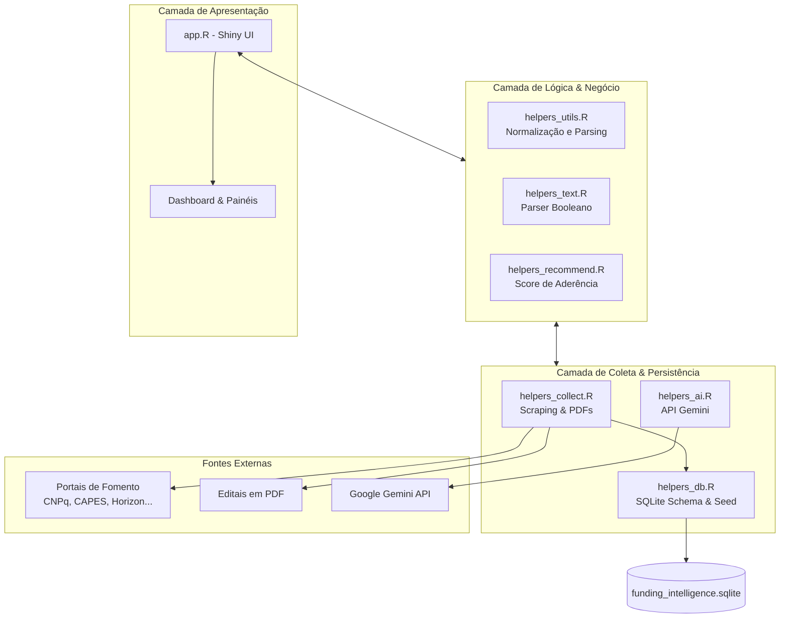

# Funding Intelligence Hub

O **Funding Intelligence Hub** é uma plataforma analítica desenvolvida em **R/Shiny** projetada para automatizar o monitoramento, a busca booleana avançada e a recomendação personalizada de editais, chamadas públicas e oportunidades de financiamento científico e tecnológico nacionais e internacionais.

O sistema foi desenhado de forma extensível, coletando metadados diretamente de portais oficiais de fomento, estruturando as informações em um banco de dados local unificado, enriquecendo os registros opcionalmente com inteligência artificial (Gemini) e fornecendo um motor de recomendação com base no perfil de interesses do usuário.

---

## 📌 Funcionalidades Principais

*   **Coleta Direta e Paginação Automatizada**: Scraping direto das fontes oficiais configuradas com paginação automática (`next`, paginação numérica e detecção de rotas).
*   **Extração de Texto de PDFs**: Download inteligente de editais anexos em formato PDF com extração de texto bruto (`pdftools`) para busca e indexação.
*   **Fallback com Navegador Headless**: Suporte à renderização de páginas fortemente baseadas em JavaScript através do `chromote`.
*   **Enriquecimento Opcional com GenAI**: Integração com a API do **Google Gemini** para limpeza de títulos, identificação de prazos e estruturação precisa de elegibilidade e áreas temáticas.
*   **Motor de Busca Booleana Completo**: Analisador sintático (*parser*) que processa consultas complexas contendo operadores lógicos `AND`, `OR`, `NOT` e agrupamentos por parênteses `( )`, além de busca de frases exatas com aspas `"`.
*   **Recomendação Personalizada**: Cálculo automático de score de aderência baseado no perfil do usuário, histórico de pesquisas e editais favoritados.
*   **Sugestão de Colaboradores**: Algoritmo de recomendação de parceiros acadêmicos/pesquisadores internos/externos com base no alinhamento temático da oportunidade.
*   **Exportação Automática**: Salvamento automático e exportação dos dados consolidados em formatos analíticos: **CSV**, **RDS** (R) e **XLSX** (Excel).

---

## ⚡ Otimização do Scraper & Evasão de Bloqueios (Novidades)

Como parte da última otimização de infraestrutura de dados (Epic 1), foram implementadas as seguintes melhorias para lidar com bloqueios de CDNs/CAPTCHAs nas agências nacionais (CNPq, CAPES, FAPESP) e otimizar a experiência do usuário no Shiny:

*   **Processamento de Coleta Assíncrona**: O acionamento da coleta de dados foi desvinculado da thread da UI do Shiny. Utilizando os pacotes `future` (com workers em modo `multisession`) e `promises`, a coleta roda em segundo plano sem travar ou congelar o dashboard. A persistência em segundo plano gerencia de forma isolada suas conexões SQLite para garantir integridade transacional.
*   **Evasão Stealth Avançada no Chromote**: Para contornar bloqueios baseados em detecção de automação, configuramos injeções via protocolo DevTools (`Page$addScriptToEvaluateOnNewDocument`) que ocultam a propriedade `navigator.webdriver`, mockam plugins e idiomas comuns do sistema operacional, e sobrescrevem assinaturas de cabeçalho do User-Agent.
*   **Integração com Playwright (Python)**: Implementamos um conector via `reticulate` que aciona de forma automatizada o Playwright em Python para executar navegadores headless com evasões e timeouts robustos como camada alternativa de raspagem.
*   **Resiliência e Registro de Falhas**: A coleta de cada agência agora ocorre em um pipeline isolado com `tryCatch`. Erros de carregamento de páginas iniciais são interceptados e gravados de forma estruturada com status `"erro"` na tabela `logs_coleta`, impedindo que a falha de acesso a uma agência interrompa a varredura das demais fontes.

---

## 🎨 Design Institucional SENAI CIMATEC & Integração Estática (Epic 2)

As últimas atualizações da interface do usuário (UI) e da integração de dados alinham a aplicação às diretrizes institucionais do **SENAI CIMATEC** e garantem alta performance de renderização:

*   **Identidade Visual Institucional**: Redesenho completo do CSS (`www/styles.css`) adotando as cores oficiais da marca (Azul Escuro `#004691` e Vermelho `#e30613`), com tipografia moderna (família de fontes **Inter** integrada via Google Fonts), sombras suaves e micro-animações interativas de hover e cliques.
*   **Logotipo Integrado**: O cabeçalho da plataforma foi adaptado com uma área dedicada para exibir o logotipo oficial em formato vetorial (SVG) de alta resolução.
*   **Consumo Exclusivo de Dados Estáticos/Locais**: O aplicativo foi estruturado para atuar offline de forma nativa e rápida. Ao iniciar ou renderizar as telas, o Shiny consome exclusivamente a base relacional local SQLite (`funding_intelligence.sqlite`), eliminando qualquer chamada ou varredura de scraping síncrona na thread principal que pudesse degradar a performance inicial.
*   **Validação da Busca Booleana e Identificação Única**: O motor de busca avançado foi validado e otimizado para realizar buscas complexas com parênteses, frases exatas e operadores lógicos diretamente nos registros estáticos locais, mapeando corretamente a coluna com os identificadores únicos gerados (`id_registro`, ex: `capes_102cbb3bcf547cae`).

---

## 🌍 Novas Entidades de Fomento & Filtro Regional (Epic 3)

Como parte da expansão do monitoramento de editais e segmentação geográfica (Epic 3), foram implementadas as seguintes melhorias:

*   **Novas Agências de Fomento**: 
    *   **FAPESC** (Fundação de Amparo à Pesquisa e Inovação do Estado de Santa Catarina): Implementação de raspagem customizada baseada na URL oficial de chamadas abertas.
    *   **EUREKA Network**: Integração de oportunidades europeias e transnacionais focadas em inovação industrial e desenvolvimento tecnológico cooperativo.
*   **Otimização do Bypass de Bloqueios**: Refinamento do detector de CDN/CAPTCHA (`has_block_signal`) para eliminar falsos positivos em páginas que utilizam scripts do Cloudflare ou contêm termos de segurança comuns em JavaScript (CSP) sem bloquear o tráfego, garantindo conexões diretas bem-sucedidas.
*   **Filtro Regional na Interface (UI)**: Inclusão do seletor `radioButtons` no painel principal permitindo filtrar instantaneamente os editais por **Bases Brasileiras**, **Bases Europeias** ou **Ambas**, atualizando reativamente os KPIs do painel, a seleção da aba "Por Financiador" e a listagem de fontes no modal de atualização de base.

---

## 📐 Arquitetura do Sistema

A aplicação adota uma organização modular em camadas de responsabilidade, separando a interface do usuário, a gestão do banco de dados, o motor de busca, o subsistema de inteligência artificial e a engine de scraping.



### 🗂️ Estrutura de Módulos (Diretório `R/`)

*   **[`app.R`](./app.R)**: Ponto de entrada do aplicativo Shiny. Define a estrutura da interface reativa (baseada em `bslib` e estilos customizados), as abas analíticas (Resultados, Por Financiador, Buscas Salvas, Editais Rastreados, Recomendados, Logs de Coleta) e gerencia o ciclo de reatividade do servidor.
*   **[`R/helpers_db.R`](./R/helpers_db.R)**: Camada de persistência. Gerencia o ciclo de vida da base SQLite local (`funding_intelligence.sqlite`), cria as tabelas relacionais, gerencia os commits dos editais rastreados, histórico de buscas e perfis, além de realizar o semeio inicial (*seeding*) de dados demonstrativos.
*   **[`R/helpers_collect.R`](./R/helpers_collect.R)**: Motor de coleta e raspagem. Despacha requisições inteligentes, executa paginação recursiva, extrai links de documentos PDF e salva exportações consolidadas de forma segura (tratando limites e codificação de caracteres).
*   **[`R/helpers_text.R`](./R/helpers_text.R)**: Subsistema de linguística e filtragem. Implementa um lexer/parser booleano recursivo que converte consultas textuais em árvores de sintaxe abstrata (AST) para avaliar expressões complexas contra o índice textual dos editais.
*   **[`R/helpers_recommend.R`](./R/helpers_recommend.R)**: Motor de recomendação. Avalia a aderência de cada edital cruzando metadados de elegibilidade, palavras-chave e financiador contra uma assinatura de interesses do usuário (construída dinamicamente).
*   **[`R/helpers_ai.R`](./R/helpers_ai.R)**: Módulo de integração generativa. Constrói prompts estruturados e consulta o endpoint oficial da Google Gemini API para retornar representações JSON limpas dos editais.
*   **[`R/helpers_utils.R`](./R/helpers_utils.R)**: Utilitários auxiliares de parsing de datas heterogêneas, conversão de moedas e normalização de strings (remoção de acentos e múltiplos espaços).

---

## 🗄️ Modelo de Dados (SQLite)

O banco de dados local armazena o histórico do usuário e os dados minerados, garantindo acesso offline rápido:

*   `fontes_financiamento`: Catálogo de agências de fomento monitoradas, com URLs de oportunidades e métodos de coleta.
*   `oportunidades`: Editais coletados com metadados extraídos (título, descrição, prazo, valor, elegibilidade, link original, pdf, idioma e campos inferidos pela IA).
*   `editais_rastreados`: Controle do funil de candidaturas do usuário (status: *avaliar*, *prioritário*, *submetido*, *descartado*).
*   `perfil_usuario`: Preferências institucionais, áreas de atuação e palavras-chave de interesse do pesquisador.
*   `buscas_salvas` & `historico_buscas`: Consultas salvas pelo usuário com opção de agendamento de alertas e registro cronológico de buscas executadas.
*   `colaboradores`: Banco de dados interno de parceiros em potencial classificados por expertise temática.
*   `logs_coleta`: Rastreabilidade completa de todas as execuções do scraper para fins de auditoria e debugging.

---

## 🚀 Requisitos e Como Executar

### 1. Pré-requisitos
A aplicação requer R >= 4.0 instalado. Para instalar todas as dependências necessárias, execute o seguinte comando no R console:

```R
install.packages(c(
  "shiny", "bslib", "DT", "dplyr", "tidyr", "purrr", "stringr", "stringi", "lubridate",
  "ggplot2", "plotly", "DBI", "RSQLite", "jsonlite", "digest", "htmltools",
  "rvest", "xml2", "httr2", "tibble", "tools", "readr", "writexl", "janitor",
  "glue", "progress", "pdftools", "polite", "future", "furrr"
))
```

*Opcional para renderização de páginas com carregamento dinâmico via JS:*
```R
install.packages("chromote")
```

### 2. Configurando a Chave do Gemini (Opcional)
Se você deseja utilizar a inteligência artificial para limpeza e extração de metadados avançados, configure a variável de ambiente `GEMINI_API_KEY`:

*   **No Windows (PowerShell/CMD antes de rodar o R):**
    ```powershell
    $env:GEMINI_API_KEY="SUA_CHAVE_AQUI"
    ```
*   **No Linux/macOS:**
    ```bash
    export GEMINI_API_KEY="SUA_CHAVE_AQUI"
    ```
*   **Diretamente dentro do console do R:**
    ```R
    Sys.setenv(GEMINI_API_KEY = "SUA_CHAVE_AQUI")
    ```

### 3. Rodando o Aplicativo
Navegue até o diretório do projeto e execute:

```R
shiny::runApp()
```

---

## 🔄 Fluxo de Trabalho do Usuário

1.  **Exploração Inicial**: Ao abrir o aplicativo pela primeira vez, a base SQLite é semeada com editais demonstrativos para visualização do painel.
2.  **Atualização da Base**: Clique em **Atualizar base** no canto superior direito para abrir o painel de coleta oficial. Selecione quais agências deseja varrer, defina os limites de páginas e ative ou desative o enriquecimento com IA.
3.  **Filtragem e Busca Avançada**: Utilize a barra de buscas principal com lógica booleana complexa (ex: `(quântica OR quantum) AND (bolsa OR grant)`) ou refine detalhes específicos no botão **Busca avançada**.
4.  **Rastreamento de Editais**: Identifique oportunidades interessantes na tabela de resultados e clique em **Rastrear**. A oportunidade será adicionada à aba **Editais rastreados**, onde você pode atualizar notas e status ao longo do ciclo de submissão do projeto.
5.  **Análise de Recomendações**: Acesse a aba **Recomendados para mim** para visualizar oportunidades com alto score de aderência calculadas dinamicamente com base nas suas preferências e pesquisadores compatíveis com o tema para possíveis coautorias.
6.  **Exportação**: A cada ciclo de coleta concluído com sucesso, bases de dados limpas e prontas para análise são gravadas em `data_exports/`.
